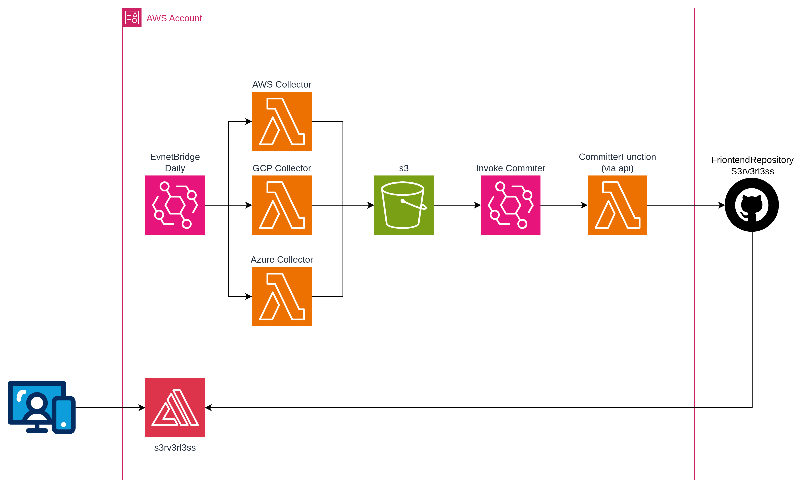

# s3rv3rl3ss-backend

Multi-cloud data pipeline that collects serverless service quotas, limits, pricing and news from AWS, GCP and Azure — and auto-commits the results to the [s3rv3rl3ss](https://github.com/olcortesb/s3rv3rl3ss) frontend repo via GitHub API.

## How it works



1. **EventBridge Schedules** trigger 4 Lambda functions daily (staggered):
   - `06:00` → AWS Collector (22 services)
   - `06:15` → GCP Collector (18 services)
   - `06:30` → Azure Collector (17 services)
   - `06:45` → Comparisons Generator (cross-provider)
2. Each **Collector** queries real APIs + static data → writes JSON to S3
3. **S3 ObjectCreated** event → **EventBridge** → triggers **CommitterFunction**
4. **CommitterFunction** uses the GitHub Contents API to commit the file directly (1 commit per file)
5. **AWS Amplify** detects the push and auto-deploys the frontend

## Data sources

### AWS Collector
- **Quotas**: [Service Quotas API](https://docs.aws.amazon.com/servicequotas/2019-06-24/apireference/API_ListServiceQuotas.html)
- **Pricing**: [AWS Price List API](https://docs.aws.amazon.com/awsaccountbilling/latest/aboutv2/price-changes.html)
- **News**: [AWS What's New RSS](https://aws.amazon.com/about-aws/whats-new/recent/feed/) + blog feeds
- **Runtimes**: Scraped from [Lambda runtimes docs](https://docs.aws.amazon.com/lambda/latest/dg/lambda-runtimes.md)
- **Limits**: Scraped from service-specific docs (markdown)
- **Integrations**: SDK shape introspection

### GCP Collector
- **News**: [GCP Release Notes RSS](https://cloud.google.com/feeds/) (per service, Atom format)
- **Limits**: Static data with docs references
- **Pricing**: Static data with docs references
- **Runtimes**: Static data

### Azure Collector
- **Pricing**: [Azure Retail Prices API](https://prices.azure.com/api/retail/prices) (public, no auth)
- **News**: [Azure Blog RSS](https://azure.microsoft.com/en-us/blog/feed/) filtered by keywords
- **Limits**: Static data with docs references
- **Runtimes**: Static data

### Comparisons Generator
- Reads all 3 provider JSONs from S3
- Generates `comparisons.json` with verified field mappings
- 13 categories (Functions, Containers, Kubernetes, NoSQL, etc.)

## Adding a service

- **AWS**: Edit `src/collector/services.py`
- **GCP**: Edit `src/gcp-collector/services.py`
- **Azure**: Edit `src/azure-collector/services.py`

Then build and deploy.

## Prerequisites

- AWS SAM CLI
- Docker (optional, no longer required for builds)

### 1. Create a GitHub Personal Access Token

1. Go to **Settings → Developer settings → Personal access tokens → Fine-grained tokens**
2. **Generate new token** with:
   - **Repository access**: Only select repositories → your frontend repo
   - **Permissions → Contents**: Read and write
3. Copy the token value

### 2. Store the token in Secrets Manager

```bash
aws secretsmanager create-secret \
  --name s3rv3rl3ss/git-token \
  --secret-string '{"token": "github_pat_xxxxxxxxxxxx"}' \
  --region us-east-1
```

Save the ARN from the output — you'll need it in the next step.

## Configuration

1. Copy the local config template:
```bash
cp samconfig.toml samconfig.local.toml
```

2. Edit `samconfig.local.toml` with your real values:
```toml
parameter_overrides = [
    "GitRepoUrl=https://github.com/<user>/s3rv3rl3ss.git",
    "GitSecretArn=arn:aws:secretsmanager:us-east-1:<account-id>:secret:<name>",
]
```

> **⚠️ Never commit `samconfig.local.toml`** — it's gitignored. The `samconfig.toml` in the repo only has placeholders.

## Deploy

```bash
# Build + deploy (any platform — no Docker needed)
sam build && sam deploy --config-file samconfig.local.toml

# Or use the script
./scripts/build.sh deploy
```

See [OPERATIONS.md](OPERATIONS.md) for manual commands, testing and troubleshooting.
