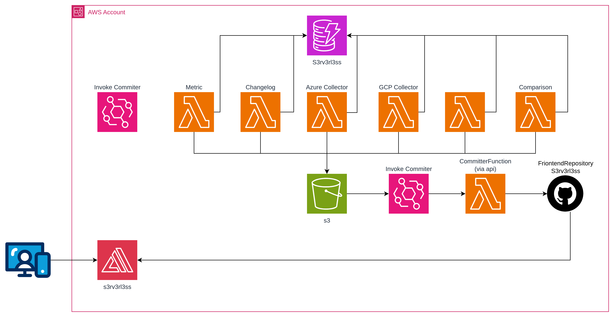

# s3rv3rl3ss-backend

Data pipeline that collects AWS serverless service quotas, limits and metadata — and auto-commits the results to the [s3rv3rl3ss](https://github.com/olcortesb/s3rv3rl3ss) frontend repo, which is deployed via AWS Amplify.

## How it works



1. **EventBridge** triggers `CollectorFunction` on a daily schedule
2. **CollectorFunction** queries the AWS Service Quotas API + static limits → writes `services-aws.json` to S3
3. **S3 ObjectCreated** event → **EventBridge** → triggers `CommitterFunction`
4. **CommitterFunction** clones the frontend repo, updates `src/data/services-aws.json`, commits and pushes
5. **AWS Amplify** detects the push and auto-deploys the frontend

## Data sources

The `CollectorFunction` gathers data from three sources per service:

- **Quotas**: [Service Quotas API](https://docs.aws.amazon.com/servicequotas/2019-06-24/apireference/API_ListServiceQuotas.html) (`list_service_quotas` with fallback to `list_aws_default_service_quotas`)
- **News**: [AWS What's New RSS](https://aws.amazon.com/about-aws/whats-new/recent/feed/) filtered by service keywords (last 5 per service)
- **Runtimes**: Scraped from the [Lambda runtimes docs](https://docs.aws.amazon.com/lambda/latest/dg/lambda-runtimes.md) markdown page, includes identifier, status and deprecation date

## Adding a service

Edit `src/collector/services.py` — move the service from `DISABLED_SERVICES` to `SERVICES`, then build and deploy.

## Prerequisites

- AWS SAM CLI
- Docker (for `sam build --use-container`)

### 1. Create a GitHub Personal Access Token

1. Go to **Settings → Developer settings → Personal access tokens → Fine-grained tokens**
2. **Generate new token** with:
   - **Repository access**: Only select repositories → your frontend repo
   - **Permissions → Contents**: Read and write
3. Copy the token value

### 2. Store the token in Secrets Manager

```bash
aws secretsmanager create-secret \
  --name s3rv3rl3ss/git-token \
  --secret-string '{"token": "github_pat_xxxxxxxxxxxx"}' \
  --region us-east-1
```

Save the ARN from the output — you'll need it in the next step.

## Configuration

1. Copy the local config template:
```bash
cp samconfig.toml samconfig.local.toml
```

2. Edit `samconfig.local.toml` with your real values:
```toml
parameter_overrides = [
    "GitRepoUrl=https://github.com/<user>/s3rv3rl3ss.git",
    "GitSecretArn=arn:aws:secretsmanager:us-east-1:<account-id>:secret:<name>",
]
```

> **⚠️ Never commit `samconfig.local.toml`** — it's gitignored. The `samconfig.toml` in the repo only has placeholders.

## Deploy

```bash
# Build + deploy
./scripts/build.sh deploy

# Or build only
./scripts/build.sh
```

See [OPERATIONS.md](OPERATIONS.md) for manual commands, testing and troubleshooting.
